# How to update the Discord rules

This repository stores the Discord server rules as a set of Markdown files. When you make a change and open a Pull Request, the change is automatically checked, merged, and then posted to the Discord rules channel.

---

## What you are editing

At the root of the repository, you'll see files named like:

- `Rules.1.intro.md`
- `Rules.2.conduct.md`
- `Rules.3.terms.md`

A few important notes:

- The number (`1`, `2`, `3`, ...) controls the order the rules appear in Discord.
- Keep the numbering sequential (no missing numbers).
- Keep each file reasonably short (Discord has a message limit).
- These files are Markdown, headings, lists, bold, links, etc. are allowed.

---

## Step-by-step: edit a rule

### 1) Open the file and start editing

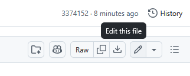

- Click into the rule file you want to change.
- Choose the edit option (pencil icon).
- Make your changes in the editor.

Tip: Keep edits focused. If you're changing multiple files, do them in a single branch so they stay together in one Pull Request.

---

## Step-by-step: commit your change

### 2) Commit your changes

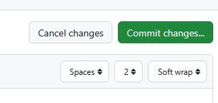

When you're happy with your edits:

- Scroll to the commit area.
- Write a short summary that describes *what* you changed (example: `Clarify appeal process wording`).
- If there's a second description box, optionally add a sentence or two with extra detail.

---

## Step-by-step: propose the change (create your branch)

### 3) Propose changes

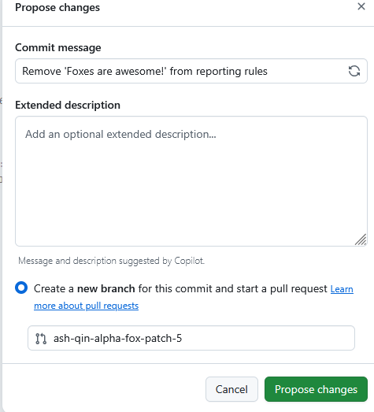

When you click **Propose changes**, GitHub will:

- Create a new branch for your changes (or update your existing one), and
- Prepare your Pull Request.

Use a clear branch name if prompted (example: `rules-clarify-links`).

---

## Step-by-step: open your Pull Request

### 4) Open a Pull Request

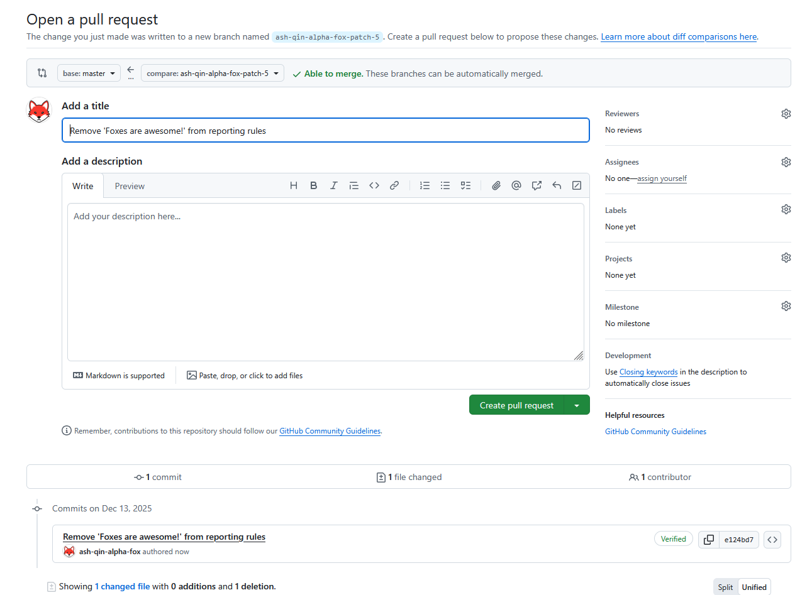

You'll be taken to the Pull Request creation screen.

- Confirm the PR is targeting the correct base branch (usually `master`).

---

## Draft vs ready: when to use a draft PR

### 5) Create a draft PR (optional)

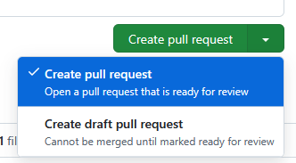

If you're not finished yet:

- Create a **Draft Pull Request**.

Draft PRs are useful when:
- You want to save your progress,
- You want feedback before it merges,
- You expect multiple follow-up edits.

When you're ready, you can mark it as **Ready for review** from the PR page.

---

## Continue editing in the same PR

### 6) Make sure you're editing your branch

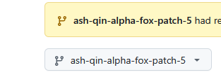

If you need to keep working after opening the PR:

- Make sure your PR branch is selected in the top-left branch dropdown before you edit files again.

If you accidentally edit the wrong branch, your changes might not end up in your Pull Request.

---

## What happens after you open a PR

### 7) If everything is OK, it merges automatically

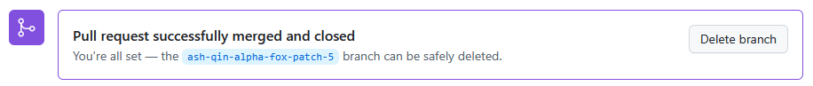

Once your Pull Request is open (and not a draft):

- Automated checks run to confirm the rules are valid and will post correctly.
- If the checks pass, the PR will be merged automatically.
- Shortly after merging, the rules in Discord will update.

---

## If checks fail

### 8) Fix the issue and push another commit

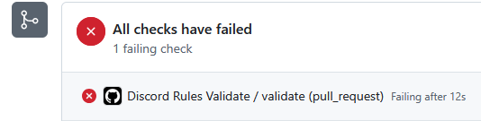

Sometimes checks fail. This usually means something in the Markdown would break formatting when posted to Discord.

Common causes:
- A code block fence isn't closed (an odd number of triple backticks: ```).
- Spoiler markers aren't closed (an odd number of `||`).
- A malformed link like `[text](missing-end`.

What to do:
1. Click into the PR and open the "Files changed" view.
2. Edit the file(s) to fix the formatting.
3. Commit the fix to the same branch.
4. The checks will rerun automatically.

---

## How to safely test formatting in Discord before committing

### 9) Use the `#sandbox` channel for trial formatting

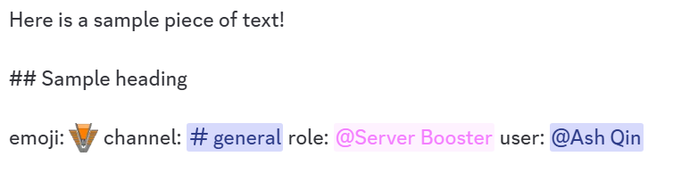

To avoid formatting surprises:
- Draft your rule text in the Discord `#sandbox` channel.
- Send the message and confirm it renders how you expect.

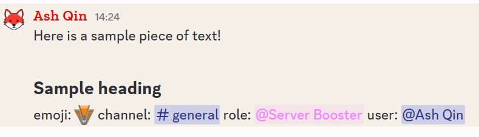

Once it looks right, you can copy the "final" text exactly as Discord interprets it.

---

## Copying the exact text (especially for mentions, channels, emojis)

### 10) Use "Copy Text" to preserve mentions and formatting

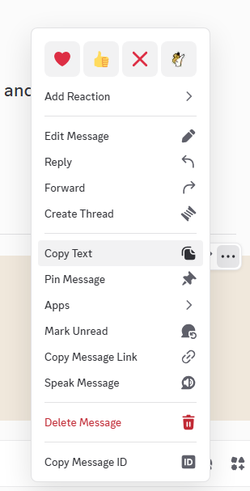

Discord can transform what you type into special formats:
- Channels become `<#channel_id>`
- Roles become `<@&role_id>`
- Users become `<@user_id>`
- Custom emojis become `<:name:id>`

To copy the text in the exact format needed:

1. Click the **three dots** on your message.
2. Choose **Copy Text**.
3. Paste that into the relevant `Rules.*.md` file in GitHub.

Example of what "Copy Text" might produce:

```md
Here is a sample piece of text!

## Sample heading

emoji: <:StargateChevronMkII:1442456582737629224> channel: <#1334193814453358715> role: <@&1351996154610712598> user: <@84618500630384640>
```

This is the safest way to ensure:

* Mentions don't break
* Formatting matches what you tested
* The rules post correctly later

---

## Quick checklist before you finish

* The rule reads clearly and matches the tone you want
* Markdown formatting looks correct (headings/lists/links)
* No unclosed code blocks (```), spoilers (`||`), or broken links
* You edited the correct `Rules.*.md` file(s)
* If you used mentions/emojis, you used Discord "Copy Text" from `#sandbox`

That's it, make the change, open the PR, and the rest is handled automatically.
